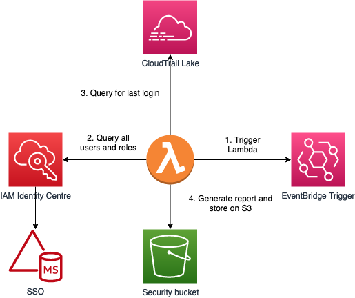

# Export Credential Reports for AWS Identity Centre leveraging CloudtrailLake

This sample provides a solution with Terraform and Python that generates credential reports for AWS Identity Centre users (formerly known as SSO) by generating a list of users and their assigned roles. Subsequently it uses CloudTrail Lake to find the date the user last logged into that role and generates a CSV file.

The SSO Credential report creates a correlation between SSO accounts defined in Identity Centre within the managed active directory and correlates them against entries within CloudTrail by querying CloudTrail Lake.

The report is generated once a week, but you can modify the code to make it more frequent or run it manually.




## Pre-requisites
CloudTrail Lake must be deployed and permissions should be assigned so that CloudTrail lake can load the CloudTrail logs succesfully within the Lake. 


# Deployment


## Build The Lambda Package
To deploy the code, first execute the `package.sh` script to create the zip file containing the Lambda code. Subsequently change the Terraform variables and deploy the code.

## Modify The Terraform Variables
- security_bucket: Name of the security bucket in the security account.
- identity_source: Navigate to IAM Identity Center. On the right side, click on “Go to settings”. Under the identity source tab, copy the identity store ID
- identity_store_arn: Navigate to IAM Identity Center. On the right side, click on “Go to settings”. Under details section, copy the ARN
- lake_id:  is the Event data store ID which can be found in CloudTrail Lake


# Report Usage
The report consists of the following fields:
-	account	: Account number
-	PermissionSetArn: ARN of the permission set	
-	PermissionSetName: The name of the permission set 
-	PermissionSetDescription: What the permission set does based on its description
-	Type: Group or User
-	GroupId: The group id 
-	GroupName: name of the group
-	Username: name of the user defined within SSO (this is generally an email address)
-	UserId: Identifier of the user 
-	LastLogin: The timestamp for when the user logged into a particular role for the past 90 days.

## Generating the report
By default the report is generated once a week at 8 PM on Sunday - refer to the code block below to change the timing:

```
resource "aws_cloudwatch_event_rule" "profile_generator_lambda_event_rule" {
  name = "profile-generator-lambda-event-rule"
  description = "Run every sunday at 8 pm"
  schedule_expression = "cron(0 20 * ? 7 *)"
}
```
There is also an automation document named `credential_report_export` that can be used to run the report manually on-demand.

## Limitations
- IAM users are excluded from the report, the source of truth starts with the users and roles defined in SSO 
- Last login entries will depend whether or not an entry is present in the CloudFormation lake. If the logs only span 90 days and the user last logged in 91 days ago, the user will show up as never logged into that role.

## Security

See [CONTRIBUTING](CONTRIBUTING.md#security-issue-notifications) for more information.

## License

This library is licensed under the MIT-0 License. See the LICENSE file.

 
